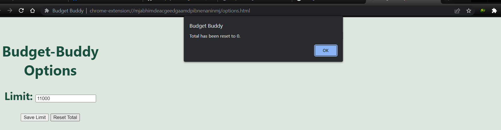
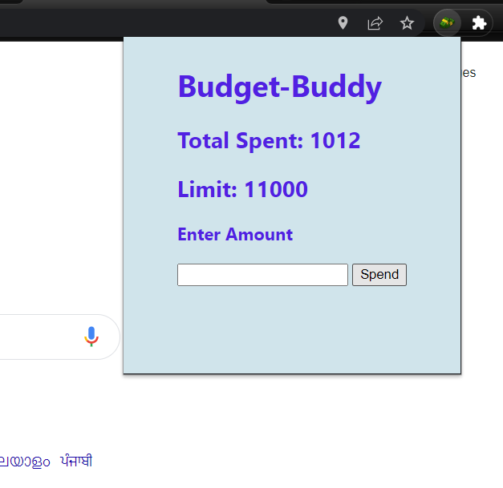
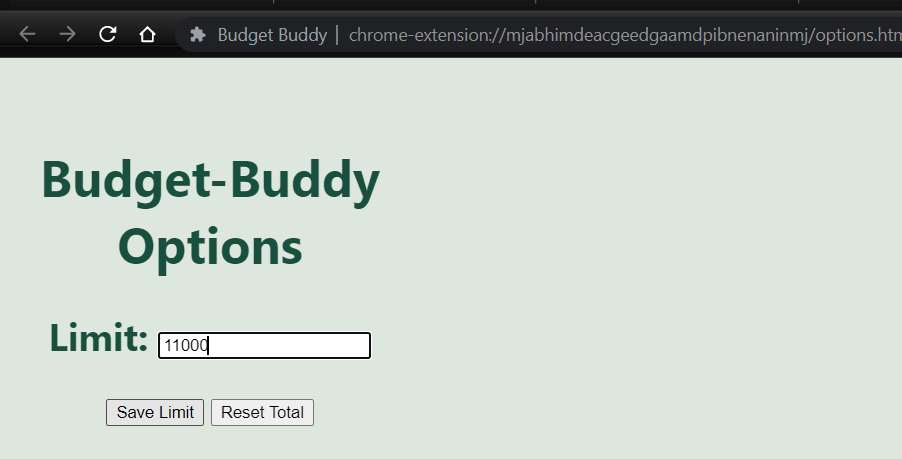
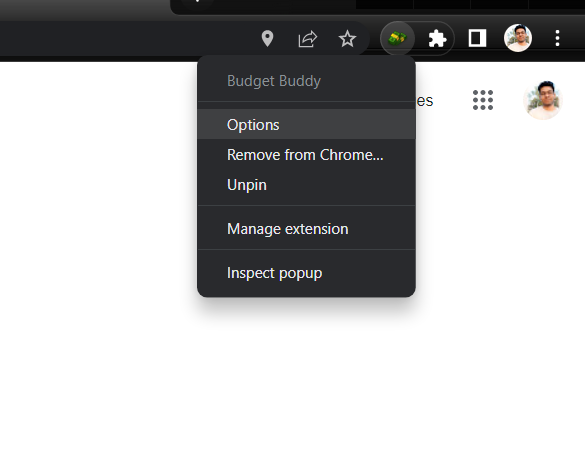

# Budget-Buddy-A chrome extension
This extension helps you to keep track of your speanding and managing by setting cost limit!

## Badges

Add badges from somewhere like: [shields.io](https://shields.io/)

## Tech Stack

* HTML
* CSS
* JavaScript
* Jquery

## Screenshot
 

